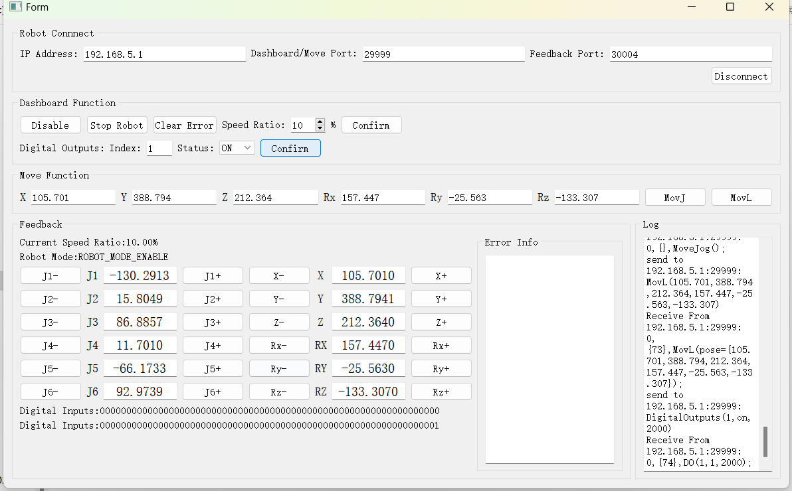

English version of the README -> please [click here](./README-EN.md)

# TCP-IP CR-CPP
关于CR的Demo，基于TCP/IP协议的C++的封装，Qt实现的UI。

## 关于版本匹配说明
1. 此Demo适用于CR系列的V4.1及以上控制器版本。

## 文件以及类的说明
1. api目录包含了CR的相关功能封装的各个类，基于纯c++编写的。
2. api/rapidjson是[腾讯的json](https://github.com/Tencent/rapidjson)解析库。
3. api目录中的类说明：
    - `BitConverter`封装了字节与基础类型的转换。
    - `DescartesPoint`笛卡尔坐标结构体封装。
    - `JointPoint`关节点坐标结构体封装。
    - `FeedbackData`反馈数据结构体封装。
    - `ErrorInfoBean`错误信息封装。
    - `ErrorInfoHelper`错误信息帮助类。
    - `DobotClient`基于tcp通信的接口类，封装了通信的基础业务。
4. `alarm_controller.json`警告报警配置文件,`alarm_servo.json`伺服报警配置文件。
5. `Form.h`,`Form.cpp`,`Form.ui`,`main.cpp`,`CppDemo.pro`是基于Qt实现的UI。

##  运行
1. 打开`Qt Creator`，并加载`CppDemo.pro`
2. 编译并运行。
3. 需要将`alarm_controller.json`和`alarm_servo.json`文件放入到执行文件所在目录。
